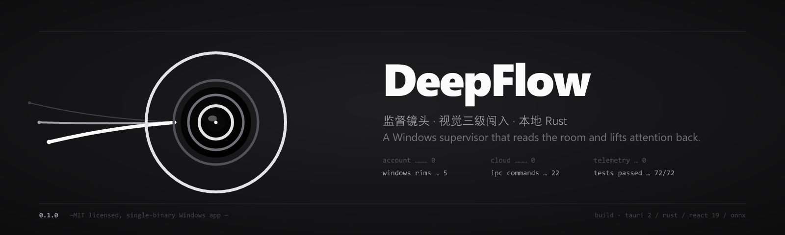
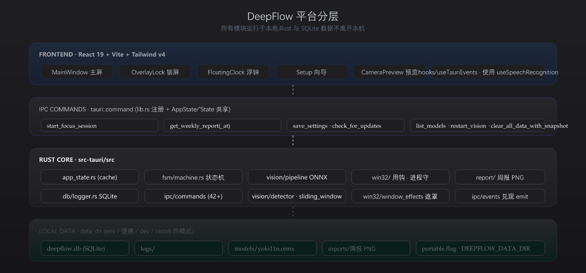
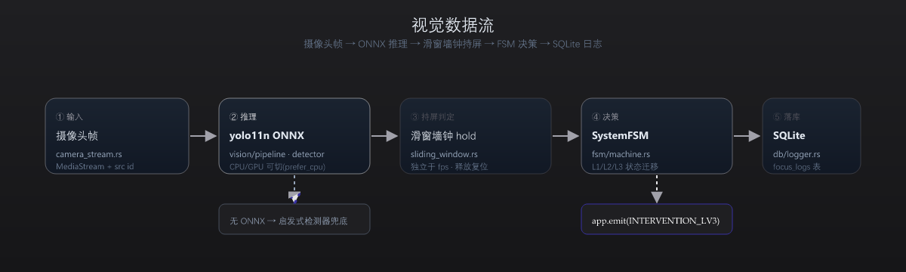
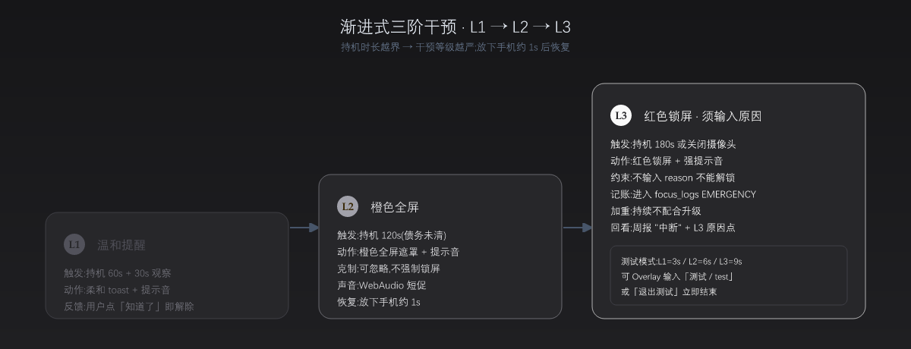
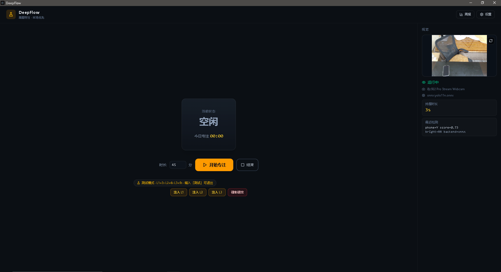
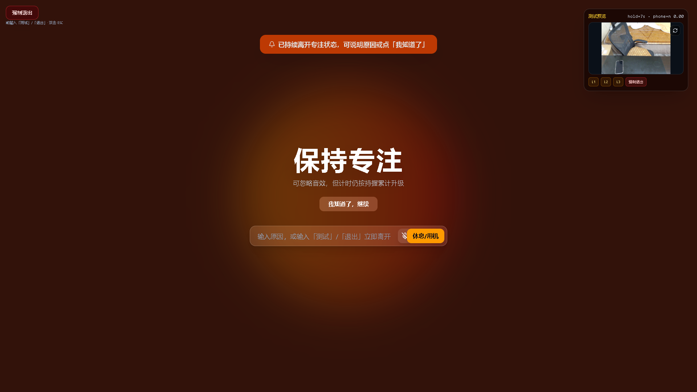

<p align="center">
  
</p>

<p align="center">
  <a href="LICENSE"></a>
  
  
  
  
  
  
  
</p>

---

**DeepFlow** 是 Windows 上一个本地应用 — 摄像头每秒看一眼你的桌面与坐姿,如果你在人机交互的“持机”姿势中停留超过阈值,它会用三级递进把你的注意力搏回去:一级轻提示,二级主屏遮罩下放低窗帘,三级进程白名单直接刷掉干扰源。

- 全部推理与存储在本地: 0 账号、0 云、0 上报; Rust 内核 + SQLite 日志 + ONNX YOLO11n 视觉模型(CPU 默认, 可切 GPU)。模型缺位时自动回退到启发式检测器。
- 数据目录可配: 环境变量、便携 flag、项目 dev data、`%LOCALAPPDATA%\DeepFlow` 四模式。
- 一个二进制, 一次安装, 不依赖任何外部服务。

---

## ✨ 核心特性

| 层 | 能力 |
|---|---|
| **主屏 / 锁屏** | 主屏全屏遮罩、5 个 React 多窗口、`win32/window_effects` Win32 置顶钩住、浮钟可调置顶与静默 |
| **进程白名单** | 周期扫描运行进程,强制最小化/关闭违禁项;白名单配置走设置页搜索添加,存 SQLite `whitelist_json` |
| **休息债务** | 专注时长转换为"债务"(debt),可配下限(默认 180s),Setup 可调,结算按钮一键消化未还债 |
| **视觉三阶闯入** | 摄像头 + ONNX yolov11n 判定"持机",滑窗墙钟 hold 防 fps 抖动,触发 L1→L2→L3 渐进式干预 |
| **会话与日志** | `focus_logs` 表全量事件(SESSION_START/EMERGENCY_EXIT/各 L 触发/原因),跨周趋势 PNG 导出 |
| **自动更新骨架** | `tauri.conf.json` 已配 pubkey,生产 HTTPS endpoint 可填即上线;启动后台检查 + 用户主动 `check_for_updates` |
| **系统集成** | 开机自启(plugin-autostart)、系统通知中心 toast(plugin-notification)、紧急热键四选一双击 ESC / F9 / Ctrl+Shift+E / Ctrl+Alt+Q |
| **数据路径** | resolve_data_dir 四模式:env / 便携 flag / 项目 dev data / `%LOCALAPPDATA%\DeepFlow` |

完整功能矩阵与历史脉络见 **[P1-STATUS.md](P1-STATUS.md)** 与 commit 历史。

---

## 🧱 架构分层

<p align="center">
  
</p>

服务端不可选、不可达 —— 图上所有模块都跑在用户机器本地。React 前端调用 `tauri::command` IPC 边界,所有文件落盘在 `data_dir`(env/便携/dev/install 四模式之一)。

---

## 🔄 视觉数据流

<p align="center">
  
</p>

无 ONNX 模型时,运行时回退到内置启发式检测器(`vision/detector.rs`)继续工作 —— 不需要先装相机才能用 DeepFlow。

---

## 🌡️ 渐进式三阶干预(核心差异化)

<p align="center">
  
</p>

DeepFlow 不“一上来就锁屏”。它对持机行为做**软→强递进**：**L1** 同时施加四路提示（提示音 chime + 系统 toast 通知 + 主屏 UI toast + 主屏状态文本由“专注中”切到“干预 L1 · 观察 30s”）——即使在全屏其它应用中也能看到、**L2** 来橙色全屏但可忽略、**L3** 才锁屏逼你输入"刷手机的原因"--并把这次事件计入 SQLite,出现到周报"中断"统计中。持机时间越级触发,越级不可逆;放下手机约 1s 后状态恢复。

> Confessions to yourself, not to a server —— L3 原因只写入本机 SQLite,周报里是匿名统计聚合,格式见 `db::logger::tests::weekly_report_*`。

---

## 🚀 快速开始

### 环境

- Rust `stable-x86_64-pc-windows-msvc`
- MSVC Build Tools(vcvars64)
- Node 18+ / npm
- WebView2
- (可选) Python 3.12 + ultralytics:导出 Yolo11n ONNX

编译前,在 **x64 Native Tools** 命令行或先执行:

```bat
"E:\1_Code\vs-buildtools\VC\Auxiliary\Build\vcvars64.bat"
```

### 启动开发

```bat
npm.cmd install
npm.cmd run tauri dev
```

仅检查 Rust:

```bat
cd src-tauri
cargo check
```

前端构建:

```bat
npm.cmd run build
```

### 测试

```bat
cd src-tauri
cargo test
```

现覆盖(77 个单元测试通过):键盘热键解析、启发式检测器、`is_operating_phone` 边界、周报 PNG 生成、SQLite 日志/周报聚合、路径策略判定、FSM 集成冒烟(Start/L1/L3/原因/紧急退出)、历史周聚合、L3 原因回看、updater 配置检测、跨周趋势、清空反悔 ROLLBACK 一致性、emergency_hotkey 默认值漂移检测。

### 视觉模型(可选)

```bat
python scripts/download_yolo_onnx.py
```

下载后置于 `<data_dir>/models/yolo11n.onnx`。

---

## 💾 数据目录策略

所有数据按优先级写在一个 `data_dir` 下(实现见 `src-tauri/src/lib.rs::resolve_data_dir`):

1. 环境变量 `DEEPFLOW_DATA_DIR` 绝对路径
2. 便携模式:可执行文件旁的 `data/`(检测 `DEEPFLOW_PORTABLE` 或标记文件 `portable.flag` / `.portable` / `DeepFlow.portable`)
3. 开发构建:项目根 `data/`(exe 路径含 `target/debug|release`)
4. 正式安装:`%LOCALAPPDATA%\DeepFlow\data`

子目录:`db/`(SQLite)、`logs/`、`models/`(ONNX,缺失时从 `seed_models/` 自动复制)、`exports/`(周报 PNG)。

前端「设置 → 路径信息」可调 `get_path_info` / `reveal_path`。路径策略手册详见 [附录 B](#user-content-appendix-b)。

---

## 🧪 测试模式

为方便片段开发与无摄像头场景:

1. 设置勾选「测试模式」并保存(阈值 L1=3s / L2=6s / L3=9s,放下约 1s 恢复)
2. 主界面或 Overlay:**注入 L1/L2/L3** 可无需手机验证 FSM
3. Overlay 对话框输入 **「测试」**(或英文 `test`、`退出测试`)→ 立即结束会话
4. L2/L3 有 WebAudio 提示音;L3 持续不配合会加重(测试约 5s)

---

## 🌐 IPC 命令总览

设置类:`get_settings` / `save_settings` / `backup_settings`
路径:`get_path_info` / `reveal_path`
会话:`start_focus_session` / `stop_session` / `request_temporary_pause` / `resume_focus_session` / `skip_debt_and_resume`
周报:`get_weekly_report` / `get_weekly_report_at` / `export_weekly_report_png`
反悔:**`clear_all_data_with_snapshot`**(快照写入 Rust 侧 Mutex 不经前端 base64)+ **`restore_last_snapshot`**(一次性取出,过期或未缓存返"无可用快照"错)
L3 原因:`get_l3_reasons`
模型:`list_models` / `reseed_models`
视觉:`get_vision_status` / `restart_vision` / `get_available_cameras`
进程:`list_running_processes`
白名单强制:`whitelist_action`(minimize / close / report 三策略)
测试注入:`test_inject_level` / `test_exit_session`
Setup:`check_setup` / `start_setup` / `open_setup_window`
更新:`check_for_updates`(`UpdaterConfigStatus` enum 自动屏蔽未配置)

---

## 🛡️ 安全与隐私

- **无 network:** 除"启动检查更新"那一行 HTTPS(正式 endpoint 未上线前为空数组),其余代码不通网络;
- **无敏感数据出本机:** 摄像头帧只在内存推理,**不落盘**;L3 原因走 SQLite 本地表,格式见 `db::logger::tests::weekly_report_*`;
- **无 hardcoded secrets:** `tauri.conf.json` 只有公钥(pubkey),私钥留在 CI/build 机的独立环境(参考 `tauri signer` 子命令);
- **快照数据保护:** `clear_all_data_with_snapshot` 后的快照字节缓存在 Rust 侧 `AppState::last_clear_snapshot`,前端调用 `restore_last_snapshot` 时 IPC 直接从 Mutex 取,base64 / size validation 不再需要(代码已删,见 commit `3bf8f49` F7 修复)。

---

## 📊 真装包路径验证清单

| 模式 | 触发条件 | 预期 `mode` | 用例 |
| --- | ------- | ---------- | --- |
| env | `DEEPFLOW_DATA_DIR=D:/tmp/df` | `env` | 启动后看设置页数据目录、写一条记录后确认出现在 D:/tmp/df |
| 便携 | exe 旁放 `portable.flag` | `portable` | exe 旁出现 data/;换机拷贝后路径跟随 exe |
| 开发 | exe 路径在 `target/debug\|release` | `dev` | 仓库 `data/` 被使用 |
| 安装 | `cargo tauri build` 生成的安装包安装 | `install` | `%LOCALAPPDATA%\DeepFlow\data` 被创建且写入 |

完整手工验收清单(包括构建、干净机安装、写入、便携对照、env 覆盖、系统集成 #23/#29/#33 自启/通知/检查更新年末配置提示)见 [附录 B](#user-content-appendix-b)。

---

## 🚧 阶段与未来

- **P0**(done):多窗体、FSM、托盘、遮罩、白名单扫描、债务、设置、调试日志
- **P1**(done):摄像头 + ONNX 检测 + L1–L3 + Setup 预览/ROI、滑窗墙钟 hold
- **P2**(done):周报 PNG 导出、紧急热键可配、数据目录四模式、便携标记 / seed 模型复制
- **P3**(进行中):进程白名单强制(`whitelist_action`)、摄像头下拉统一、聚焦时长上下限、Setup 可配债务下限、白名单进程搜索、债务结算、模型自管理 UI、周报历史周查看、L3 原因回看、托盘菜单扩展、CSP 收紧、浮钟置顶可调、开机自启 / 系统通知 / 自动更新骨架、关于页版本信息、通知全覆盖

---

## 📸 截图

<table align="center">
  <tr>
    <td align="center"><b>主屏（测试模式 + 摄像头预览）</b></td>
    <td align="center"><b>L3 Overlay 锁屏门口拦截</b></td>
  </tr>
  <tr>
    <td align="center"></td>
    <td align="center"></td>
  </tr>
</table>

> 主屏:状态 / 侧栏 / 启控按钮 + 测试模式摄像头预览。
> L3 Overlay:计时进入第三阶，启动全屏锁屏门口拦截。

---

## 🤝 贡献

仓库目前为个人作品集导向,如要协作请先开 issue 描述您要改动的事项(尤其是 IPC 契约 / settings 字段 / FSM 状态迁移类改动)。

提交约定:
- feat / fix / docs / chore / test / refactor;
- 中文 commit message,首行 ≤ 72 字;
- 任何涉及 IPC 命令增删请同步 `src/types/tauri-ipc.ts` 与 `src-tauri/src/lib.rs` invoke_handler 注册数组。

---

## 🎨 设计与视觉

品牌选型中心词 = **监督**(摄像头为你读帧、滑动窗读持机秒、设置读债务)。Logo / hero / 所有 SVG 统一走 zinc 黑灰冷峻族 (底 `#161618` / L1 `#52525B` / L2 `#A1A1AA` / L3 `#FAFAFA` / 文字 `#E4E4E7`)。原则:

- **0 渐变 cyan→violet**: 绝不用 Linear / Vercel / AI 默认配色自带气质;
- **0 强彩告警三色**: L1 / L2 / L3 给的是**灰度阶进**, 靠明度对比传递"紧", 不是靠红黄绿荧光;
- **参照真实业界**: Cold Turkey Blocker 的 zinc 工具感、RescueTime 的严肃、Forest 的造物生态。

品牌过程在设计迭代后收敛于 hero：顶部 hero 中的三圈 iris 即品牌标识（L1 暗→L3 亮，中心点 SteelTeal 镜心）。logo 源文件与导出资产悉存于 `logos/`（concepts 3 + iterations 18 + export 10 = 10/16/32/48/128/192/256/512/1024/2048 px PNG + `icon.ico`），迭代调色游离过程见 `logos/preview.html`（本地设计低频率不对 README 读者渲染，但作为 Git 资产可查看）。

---

## 📜 License

[MIT](LICENSE) © 2025 ClumsyLucid ([@Phoenix0531-sudo](https://github.com/Phoenix0531-sudo))

## 🙏 致谢

- [Tauri 2](https://tauri.app) — 应用外壳与 IPC;
- [React 19](https://react.dev) + [Vite 6](https://vitejs.dev) — 前端栈;
- [Ultralytics YOLO11](https://github.com/ultralytics/ultralytics) — ONNX 视觉模型;
- [rusqlite](https://github.com/rusqlite/rusqlite) — SQLite 绑定;
- [Tailwind CSS v4](https://tailwindcss.com) — 样式;
- [lucide-react](https://lucide.dev) — 图标。

---

<a id="appendix-a"></a>

## 附录 A · 紧急退出热键副作用

设置页「紧急热键」字段选 4 种之一;`save_settings` 后 `keyboard_hook` 原子热更新(无需重启)。

**副作用**:紧急退出会**立即结束当前专注会话**,该次会话不计入今日专注;若处于 L3 颂罚,会写入 `EMERGENCY_EXIT` 日志事件(`focus_logs` 表,`event_type='emergency_exit'`,`reason='紧急退出'`),并在周报中以「中断」统计。同时隐藏浮钟、复位遮罩契约。

<a id="appendix-b"></a>

## 附录 B · 路径策略主题验证手册

四种模式需在各自环境下手工验收,重点检查 `get_path_info` 返回的 `mode` 字段与写入位置(见上表 + 下方额外系统集成勾选):

1. **构建**
   - [ ] `npm run tauri build` 成功,产物含 `DeepFlow_x.y.z_x64-setup.exe`
2. **干净机 / 干净用户安装**
   - [ ] 安装后启动,设置页「数据目录」=`%LOCALAPPDATA%\DeepFlow\data`
   - [ ] `get_path_info.mode` = `install`
3. **写入验证**
   - [ ] 完成一次专注会话后,`%LOCALAPPDATA%\DeepFlow\data\deepflow.db` 存在且增长
   - [ ] 导出周报 PNG 落在 `%LOCALAPPDATA%\DeepFlow\data\exports\`
4. **便携对照**
   - [ ] 把安装产物旁放 `portable.flag` 再启动,mode 切到 `portable`,数据写到 exe 旁 `data/`
5. **环境变量覆盖**
   - [ ] 设置 `DEEPFLOW_DATA_DIR=D:\\tmp\\df` 启动,mode=`env`,写入该目录
6. **系统集成(#23/#29/#33)**
   - [ ] 开启「登录自启」后,任务管理器「启动」可见 DeepFlow
   - [ ] 「测试通知」弹出系统通知中心 toast
   - [ ] 「检查更新」在未配置 endpoint/pubkey 时返回 `UpdaterConfigStatus::NotConfigured`(非"已是最新")

<a id="appendix-c"></a>

## 附录 C · 干预约定速查

- 债务下限:3 分钟(180 秒,可在 Setup 中调 `debt_floor_secs`)
- L1:持机 60s + 30s 观察 + 「知道了」
- L2:持机 120s,橙色全屏 + 声音,可忽略
- L3:持机 180s 或关摄像头,红色锁屏直到输入原因
- 黑屏手机(亮度 < 40 且无手-机重叠)不算操作

<a id="appendix-d"></a>

## 附录 D · 白名单强制端到端

详见 [docs/whitelist-e2e.md](docs/whitelist-e2e.md),覆盖 classify → select_targets → 执行 minimize/close → 事件 emit 到前端 toast 的完整链路。
